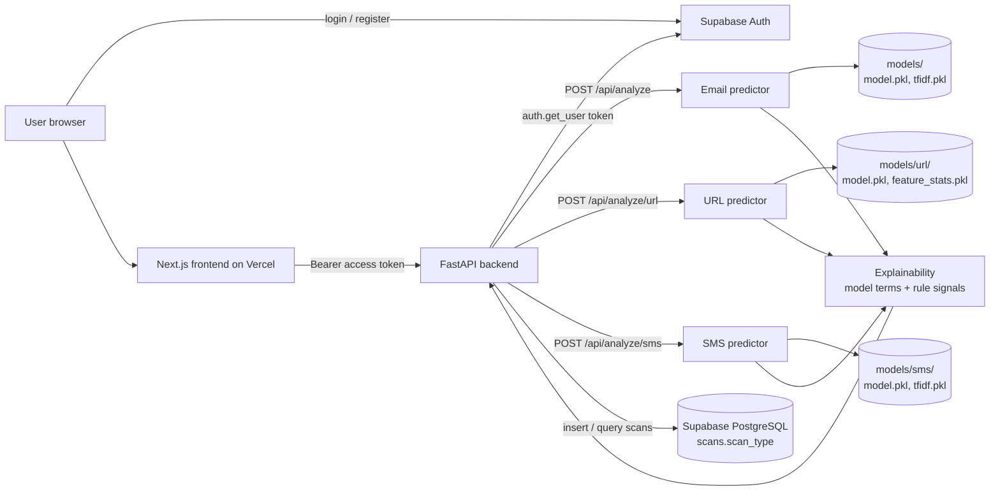
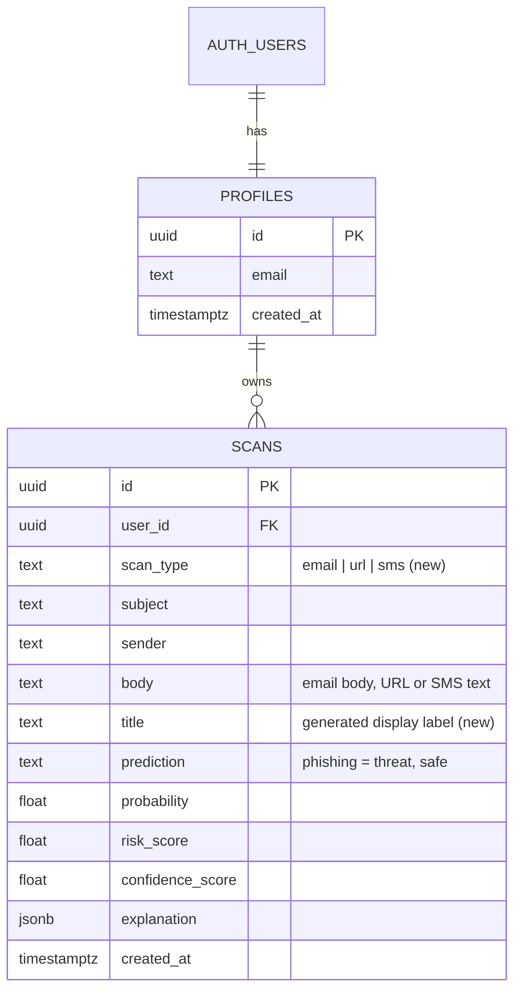

# ThreatGuard

AI-powered threat detection for **email phishing**, **malicious URLs** and **SMS scams**. Paste a message, link or text and get a verdict, risk score, confidence, probability and a plain-language explanation. Every scan is stored in Supabase and feeds a single dashboard and history.

- **Frontend:** Next.js 15, TypeScript, Tailwind CSS, shadcn-style UI components, Recharts
- **Backend:** FastAPI (Python)
- **ML:** one model per channel. Logistic Regression, Random Forest and XGBoost are trained and compared, and the best by F1 is saved
- **Data and auth:** Supabase PostgreSQL + Supabase Auth

Upgrading an existing install? Read [`docs/UPGRADE.md`](docs/UPGRADE.md) first. It lists every new and changed file and the merge steps.

## Architecture



Each channel follows the same flow: input, preprocessing (text cleaning for email and SMS, feature extraction for URLs), model, probability, confidence, explanation, stored scan.

## ER diagram



How each type uses the `scans` columns:

| scan_type | subject | sender | body |
| --- | --- | --- | --- |
| email | email subject | sender address | email body |
| url | empty | empty | the URL |
| sms | empty | sender id or number (optional) | message text |

`prediction` keeps its two original values. `phishing` means "threat" for every type (phishing email, malicious URL, scam SMS), and the UI labels it per type.

## Project structure

```
threatguard/
  supabase/
    schema.sql                                  # original schema (unchanged)
    migrations/20261003_multi_channel_scans.sql # additive upgrade
  docs/UPGRADE.md
  backend/
    app/{api,services,schemas,core}/
    ml/
      preprocessing/   text.py (email)  sms.py  url.py
      training/        pipeline.py (shared)  dataset.py  sms_*.py  url_*.py
      inference/       predictor.py  sms_predictor.py  url_predictor.py
      explainability/  rules.py  explainer.py  sms_explainer.py  url_explainer.py
    datasets/          generate_sample.py  generate_sample_sms_url.py
    models/            email: models/   sms: models/sms/   url: models/url/
    train.py  train_sms.py  train_url.py
  frontend/
    app/ components/ hooks/ services/ types/ lib/
```

## Setup

### 1. Supabase

1. Create a project at supabase.com.
2. SQL Editor: run `supabase/schema.sql` (new project) and then `supabase/migrations/20261003_multi_channel_scans.sql`. For an **existing** project run only the migration. It is additive and safe to repeat.
3. Authentication > Providers > Email. For local testing you can turn off "Confirm email". Otherwise add `http://localhost:3000/auth/callback` (and your production URL) under URL Configuration > Redirect URLs.
4. Settings > API: copy the project URL, the `anon` key and the `service_role` key.

### 2. Train the models

Each channel is trained separately and stored in its own folder. No trained models are included.

| Channel | Dataset columns | Command | Output folder |
| --- | --- | --- | --- |
| Email | `subject,sender,body,label` or `email_text,label` | `python train.py --data datasets/emails.csv` | `models/` |
| SMS | `message,label` | `python train_sms.py --data datasets/sms.csv` | `models/sms/` |
| URL | `url,label` | `python train_url.py --data datasets/urls.csv` | `models/url/` |

Labels: `0` legitimate, `1` threat. Common names are mapped automatically (`ham`/`spam`, `benign`/`malicious`/`phishing`/`defacement`/`malware`, `good`/`bad`).

```bash
cd backend
python -m venv .venv && source .venv/bin/activate     # Windows: .venv\Scripts\activate
pip install -r requirements.txt
```

Shared flags: `--models logistic_regression random_forest xgboost`, `--test-size 0.2`, `--seed 42`. The email and SMS trainers also accept `--max-features` and `--min-df`.

Each run writes `model.pkl`, `metadata.json` and `reports/` (confusion matrix PNG and classification report per model, plus `model_comparison.json`). Email and SMS also write `tfidf.pkl` and `term_direction.pkl`. URL also writes `feature_stats.pkl`.

The URL model reads the scheme, so train on URLs as they will be pasted (with `http://` or `https://`). Training and prediction use the same 37 features, listed in `ml/preprocessing/url.py`. If you change them, retrain: the predictor refuses a model trained on a different feature set.

To smoke-test the pipelines without real data: `python datasets/generate_sample_sms_url.py` (and `generate_sample.py` for email). That data is synthetic and its metrics mean nothing.

You can train only the channels you need. A channel without a trained model returns HTTP 503 with a message naming the command to run, and the rest keep working.

### 3. Run the backend

```bash
cd backend
cp .env.example .env      # SUPABASE_URL, SUPABASE_SERVICE_ROLE_KEY, CORS_ORIGINS
uvicorn app.main:app --reload --port 8000
```

`http://localhost:8000/health` reports each model: `{"models": {"email": ..., "sms": ..., "url": ...}}`. The service role key is secret and must never reach the frontend.

### 4. Run the frontend

```bash
cd frontend
cp .env.example .env.local   # Supabase URL, anon key, NEXT_PUBLIC_API_URL=http://localhost:8000
npm install
npm run dev
```

## API

All `/api` endpoints require `Authorization: Bearer <Supabase access token>`.

| Method | Path | Description |
| --- | --- | --- |
| POST | `/api/analyze` | Email. Body `{subject, sender, body}`. Unchanged. |
| POST | `/api/analyze/url` | Body `{url}`. The URL is analysed as text and never requested. |
| POST | `/api/analyze/sms` | Body `{message, sender?}`. |
| GET | `/api/history` | Query: `page`, `page_size`, `search`, `prediction` (`phishing`/`safe`), `scan_type` (`email`/`url`/`sms`), `sort`. |
| GET | `/api/history/{id}` | One scan with its explanation. |
| GET | `/api/dashboard` | Metrics, weekly trend, daily activity, risk distribution, threats vs safe, detection types, recent activity. |
| GET | `/health` | Model status per channel (no auth). |

Every analyze endpoint returns the stored scan: `scan_type`, `prediction`, `probability`, `risk_score` (probability x 100), `confidence_score`, `risk_level` (low < 30, medium < 60, high < 80, critical >= 80) and `explanation`.

## Explainability

Each explanation combines model-derived terms with rule signals. The verdict comes from the model alone, and rules never change the score.

- **Email:** coefficient (or feature importance) x TF-IDF per word, plus checks for look-alike or brand-mismatched sender domains, urgency, credential-harvesting and financial phrases, and suspicious links.
- **SMS:** the same word contributions, plus checks for prize offers, OTP/KYC/credential requests, delivery-fee scams, call and short-code prompts, urgency, threats and suspicious links.
- **URL:** per-feature contributions (exact for logistic regression, importance-weighted deviation for tree models), plus checks for IP hosts, shorteners, high-abuse extensions, punycode, brand names on the wrong domain, credential keywords, redirect parameters, executable downloads and random-looking domains.

## Deployment

**Frontend (Vercel):** root directory `frontend`, with `NEXT_PUBLIC_SUPABASE_URL`, `NEXT_PUBLIC_SUPABASE_ANON_KEY`, `NEXT_PUBLIC_API_URL`.

**Backend:** `backend/vercel.json` and `backend/api/index.py` support a Vercel Python deployment (commit the trained `models/**/*.pkl`). Vercel's 250 MB unzipped limit may be exceeded by scikit-learn plus XGBoost. If so, train with `--models logistic_regression random_forest` and remove `xgboost` from `requirements.txt`, or use the `Procfile` on Render, Railway or Fly. Set `SUPABASE_URL`, `SUPABASE_SERVICE_ROLE_KEY` and `CORS_ORIGINS`. Optional: `SMS_MODEL_DIR`, `URL_MODEL_DIR` (default `models/sms`, `models/url`).

## Security notes

- Tokens are verified server-side with Supabase on every request. Every query is filtered by the authenticated user's id, and RLS is enabled on both tables.
- URL analysis is lexical only. The backend never fetches or resolves submitted URLs.
- Inputs are length-limited and validated (email sender address, URL scheme and host, SMS length). CORS is restricted to `CORS_ORIGINS`.
